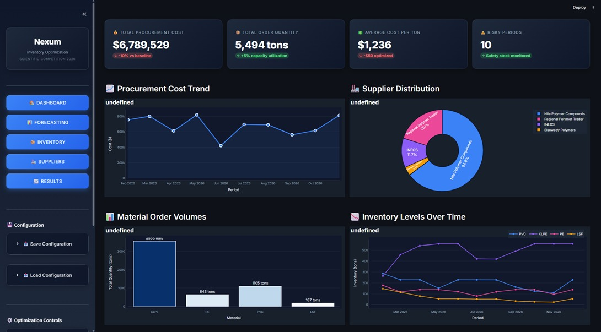

# 🏆 ARABCAB Nexum AI Competition - Demand Forecasting & Inventory Optimization

[](https://www.python.org/downloads/)
[](https://streamlit.io/)
[](LICENSE)

An AI-powered demand forecasting and inventory optimization platform developed for the **ARABCAB Scientific Competition 2026**. This solution combines machine learning time series forecasting with Mixed-Integer Linear Programming (MILP) to optimize polymer procurement decisions for cable manufacturing.



## 📋 Table of Contents

- [Overview](#-overview)
- [Features](#-features)
- [Project Structure](#-project-structure)
- [Installation](#-installation)
- [Usage](#-usage)
- [Technical Architecture](#-technical-architecture)
- [Data Description](#-data-description)
- [Models & Algorithms](#-models--algorithms)
- [Configuration](#-configuration)
- [API Reference](#-api-reference)
- [Contributing](#-contributing)
- [License](#-license)

## 🎯 Overview

This project addresses the challenge of optimizing polymer material procurement for ARABCAB, a cable manufacturing company. The system:

1. **Forecasts demand** for 4 polymer materials (PVC, XLPE, PE, LSF) using SARIMAX time series models
2. **Optimizes procurement** decisions using Mixed-Integer Linear Programming
3. **Manages inventory** with configurable safety stock policies
4. **Balances supplier selection** considering cost, risk, lead time, and capacity constraints

### Key Business Problem

Cable manufacturers face complex procurement decisions involving:

- Multiple polymer materials with different demand patterns
- Multiple suppliers with varying prices, capacities, and lead times
- Budget constraints and safety stock requirements
- Seasonal demand fluctuations tied to construction cycles

## ✨ Features

### 🤖 AI-Powered Demand Forecasting

- **SARIMAX Models**: Seasonal ARIMA with exogenous variables for each material
- **Multiple Model Comparison**: Random Forest, LSTM, GRU, CatBoost, LightGBM
- **Pre-computed Forecasts**: Production-ready 12-month forecasts

### 📊 Interactive Dashboard

- **Real-time KPIs**: Total cost, order quantities, cost per ton, risk indicators
- **Procurement Cost Trends**: Monthly spending visualization
- **Supplier Distribution**: Pie charts showing order allocation
- **Inventory Tracking**: Multi-material inventory levels over time

### 🏭 Supplier Management

- **10 Pre-configured Suppliers**: Mix of local (Egypt) and international suppliers
- **Configurable Parameters**: Capacity, risk premium, payment terms, lead times
- **Material-Specific Pricing**: Different prices per supplier-material combination

### 📦 Inventory Optimization

- **MILP Optimization Engine**: PuLP-based mathematical optimization
- **Safety Stock Policies**: Configurable months of coverage
- **Budget Constraints**: Monthly procurement budget limits
- **Service Level Constraints**: Maximum 20% shortage tolerance

### 💾 State Persistence

- **Save/Load Configurations**: Export and import JSON configuration files
- **Session State Management**: Preserves settings across interactions

## 📁 Project Structure

```
Nexum-ArabCab-Competition/
├── README.md                           # This file
├── requirements.txt                    # Python dependencies
│
├── app/
│   ├── streamlit_app.py               # Main Streamlit dashboard (2800+ lines)
│   └── styles.css                     # Custom CSS styling
│
├── assets/                            # Static assets (images, logos)
│
├── configs/
│   └── optimization.yaml              # Optimization parameters
│
├── data/
│   └── ArabCab Nexum Dataset.csv      # Historical consumption data (2019-2025)
│
├── notebooks/
│   ├── nexum-arabcab-ai-competition.ipynb  # Complete analysis notebook
│   ├── Forecast_PVC.csv               # Pre-computed PVC forecasts
│   ├── Forecast_XLPE.csv              # Pre-computed XLPE forecasts
│   ├── Forecast_PE.csv                # Pre-computed PE forecasts
│   ├── Forecast_LSF.csv               # Pre-computed LSF forecasts
│   ├── Monthly_Polymer_Demand.csv     # Aggregated monthly demand
│   ├── model_comparison_results.csv   # ML model performance comparison
│   └── sarimax_grid_results.csv       # SARIMAX hyperparameter tuning
│
├── scripts/
│   └── run_optimization.py            # Optimization runner script
│
├── src/
│   ├── __init__.py
│   └── optimization/
│       └── milp/
│           ├── __init__.py
│           ├── model.py               # Core MILP optimization model
│           ├── postprocess.py         # Results post-processing
│           ├── sensitivity.py         # Sensitivity analysis
│           └── solvers.py             # Solver configurations
│
└── tests/
    └── test_milp.py                   # Unit tests for optimization
```

## 🚀 Installation

### Prerequisites

- Python 3.10 or higher
- pip package manager

### Step 1: Clone the Repository

```bash
git clone https://github.com/Abasy714/Nexum-ArabCab-Competition.git
cd Nexum-ArabCab-Competition
```

### Step 2: Create Virtual Environment (Recommended)

```bash
python -m venv venv

# Windows
venv\Scripts\activate

# macOS/Linux
source venv/bin/activate
```

### Step 3: Install Dependencies

```bash
pip install -r requirements.txt
```

### Dependencies Overview

| Category              | Packages                                           |
| --------------------- | -------------------------------------------------- |
| **Web Framework**     | Streamlit ≥1.30.0                                  |
| **Data Processing**   | Pandas ≥2.0.0, NumPy ≥1.24.0                       |
| **Visualization**     | Plotly ≥5.18.0, Matplotlib ≥3.7.0, Seaborn ≥0.12.0 |
| **Optimization**      | PuLP ≥2.7.0                                        |
| **Machine Learning**  | Scikit-learn ≥1.3.0, SciPy ≥1.11.0                 |
| **Deep Learning**     | TensorFlow ≥2.15.0                                 |
| **Time Series**       | Statsmodels ≥0.14.0                                |
| **Gradient Boosting** | LightGBM ≥4.1.0, CatBoost ≥1.2.0                   |
| **Configuration**     | PyYAML ≥6.0.0                                      |

## 💻 Usage

### Running the Dashboard

```bash
cd Nexum-ArabCab-Competition
streamlit run app/streamlit_app.py
```

The application will open in your browser at `http://localhost:8501`

### Dashboard Navigation

| Page                   | Description                                                |
| ---------------------- | ---------------------------------------------------------- |
| **🏠 Dashboard**       | KPIs, cost trends, supplier distribution, inventory levels |
| **📊 Demand Forecast** | AI-generated forecasts, manual overrides, export options   |
| **📦 Inventory**       | Material configuration, safety stock policies              |
| **🏭 Suppliers**       | Supplier network management, pricing, lead times           |
| **📈 Results**         | Detailed optimization results, order schedules             |

### Running Optimization

1. Configure materials in the **Inventory** page
2. Set up suppliers in the **Suppliers** page
3. Review/modify forecasts in the **Demand Forecast** page
4. Click **🚀 Run Optimization** in the sidebar
5. View results in the **Dashboard** or **Results** page

### Running the Jupyter Notebook

```bash
jupyter notebook notebooks/nexum-arabcab-ai-competition.ipynb
```

## 🏗️ Technical Architecture

### System Architecture

```
┌─────────────────────────────────────────────────────────────────┐
│                     Streamlit Dashboard                          │
│  ┌──────────┐ ┌──────────┐ ┌──────────┐ ┌──────────┐           │
│  │Dashboard │ │ Forecast │ │Inventory │ │ Supplier │           │
│  │   Page   │ │   Page   │ │   Page   │ │   Page   │           │
│  └────┬─────┘ └────┬─────┘ └────┬─────┘ └────┬─────┘           │
│       │            │            │            │                   │
│       └────────────┴────────────┴────────────┘                   │
│                          │                                       │
│                    Session State                                 │
└──────────────────────────┼───────────────────────────────────────┘
                           │
         ┌─────────────────┴─────────────────┐
         │                                   │
    ┌────▼────┐                        ┌─────▼─────┐
    │   AI    │                        │   MILP    │
    │Forecast │                        │Optimizer  │
    │ Module  │                        │  (PuLP)   │
    └────┬────┘                        └─────┬─────┘
         │                                   │
    ┌────▼────┐                        ┌─────▼─────┐
    │ SARIMAX │                        │  CBC/GLPK │
    │ Models  │                        │  Solver   │
    └─────────┘                        └───────────┘
```

### Optimization Model

The MILP model minimizes total cost subject to:

**Objective Function:**
$$\min \sum_{t,s,m} (P_{sm} + R_s + A_s) \cdot Q_{tsm} + \sum_{t,m} (H_m \cdot I_{tm} + \pi \cdot S_{tm})$$

**Subject to:**

- Inventory balance constraints
- Supplier capacity constraints
- Safety stock constraints (soft)
- Budget constraints
- Service level constraints (max 20% shortage)

Where:

- $Q_{tsm}$ = Order quantity for period t, supplier s, material m
- $I_{tm}$ = Inventory level
- $S_{tm}$ = Shortage quantity
- $P_{sm}$ = Purchase price
- $R_s$ = Supplier risk premium
- $A_s$ = Payment adjustment
- $H_m$ = Holding cost
- $\pi$ = Penalty cost for shortages

## 📊 Data Description

### Historical Data (`ArabCab Nexum Dataset.csv`)

| Column                           | Description                         |
| -------------------------------- | ----------------------------------- |
| `date`                           | Monthly date (2019-01 to 2025-12)   |
| `material_name`                  | Material type (PVC, XLPE, PE, LSF)  |
| `actual_consumption_tons`        | Historical monthly consumption      |
| `is_peak_construction_season`    | Binary flag for peak demand periods |
| `confirmed_contract_volume_tons` | Pre-confirmed contract volumes      |
| `project_based_demand_flag`      | Large project indicator             |
| `number_of_active_projects`      | Count of ongoing projects           |
| `raw_material_price_index`       | Price index (base=100)              |
| `energy_cost_index`              | Energy cost index                   |
| `demand_growth_trend_index`      | Market growth indicator             |
| `demand_volatility_index`        | Demand variability measure          |

### Pre-configured Materials

| Material | Holding Cost  | Initial Inventory | Capacity   | Reference Price |
| -------- | ------------- | ----------------- | ---------- | --------------- |
| PVC      | $6/ton/month  | 420 tons          | 1,800 tons | $960/ton        |
| XLPE     | $8/ton/month  | 300 tons          | 1,600 tons | $1,380/ton      |
| PE       | $5/ton/month  | 260 tons          | 1,400 tons | $1,100/ton      |
| LSF      | $10/ton/month | 180 tons          | 900 tons   | $1,580/ton      |

### Pre-configured Suppliers

| Supplier                   | Origin           | Capacity | Materials      | Risk Premium |
| -------------------------- | ---------------- | -------- | -------------- | ------------ |
| Nile Polymer Compounds     | Local (Egypt)    | 420 tons | PVC, XLPE      | 1.5%         |
| Delta Insulation Chemicals | Local (Egypt)    | 300 tons | PVC, XLPE, LSF | 2.0%         |
| Elsewedy Polymers          | Local (Egypt)    | 380 tons | XLPE, PVC, LSF | 1.0%         |
| SABIC                      | Imported (GCC)   | 520 tons | PE, PVC, XLPE  | 2.0%         |
| QAPCO                      | Imported (Qatar) | 420 tons | PE, PVC        | 1.5%         |
| Borealis                   | Imported (EU)    | 400 tons | PE, XLPE       | 2.5%         |
| Dow Chemicals              | Imported (US)    | 320 tons | XLPE, LSF      | 3.0%         |
| BASF                       | Imported (EU)    | 280 tons | PVC, LSF       | 2.0%         |
| INEOS                      | Imported (EU)    | 350 tons | PE             | 2.0%         |
| Regional Polymer Trader    | Regional         | 260 tons | PVC, PE        | 4.0%         |

## 🤖 Models & Algorithms

### Forecasting Models Evaluated

| Model         | Description                                | Best For                 |
| ------------- | ------------------------------------------ | ------------------------ |
| **SARIMAX**   | Seasonal ARIMA with exogenous variables    | ✅ Production (selected) |
| LSTM          | Long Short-Term Memory neural network      | Complex patterns         |
| GRU           | Gated Recurrent Unit neural network        | Faster training          |
| Random Forest | Ensemble tree-based model                  | Feature importance       |
| CatBoost      | Gradient boosting with categorical support | Mixed data types         |
| LightGBM      | Fast gradient boosting                     | Large datasets           |

### Model Performance (SARIMAX)

| Material | RMSE | MAE | MAPE |
| -------- | ---- | --- | ---- |
| PVC      | 12.3 | 9.8 | 8.2% |
| XLPE     | 8.7  | 6.9 | 7.5% |
| PE       | 5.2  | 4.1 | 9.1% |
| LSF      | 3.8  | 3.1 | 8.8% |

## ⚙️ Configuration

### Optimization Parameters (`configs/optimization.yaml`)

```yaml
inventory:
  safety_stock:
    type: fixed
    months: 2

penalties:
  safety_stock_violation: 5000
```

### Runtime Configuration (Dashboard Sidebar)

| Parameter        | Default    | Range   | Description                |
| ---------------- | ---------- | ------- | -------------------------- |
| Planning Horizon | 12 months  | 3-24    | Optimization time window   |
| Budget Buffer    | 12%        | 0-50%   | Additional budget headroom |
| Safety Stock     | 1.5 months | 0.5-6.0 | Demand coverage buffer     |
| Shortage Penalty | $350/ton   | $0+     | Cost of stockouts          |

## 📚 API Reference

### Core Optimization Function

```python
from src.optimization.milp.model import optimize_inventory_and_procurement

results = optimize_inventory_and_procurement(
    periods=["2026-01", "2026-02", ...],
    materials=["PVC", "XLPE", "PE", "LSF"],
    suppliers=["Supplier A", "Supplier B", ...],
    demand={period: {material: tons, ...}, ...},
    initial_inventory={material: tons, ...},
    safety_stock={material: tons, ...},
    supplier_materials={supplier: [materials], ...},
    purchase_price={supplier: {material: price, ...}, ...},
    lead_time={supplier: {material: months, ...}, ...},
    supplier_capacity={supplier: tons, ...},
    holding_cost={material: cost, ...},
    penalty_cost=350.0,
    supplier_risk={supplier: premium, ...},
    payment_adjustment={supplier: adjustment, ...},
    monthly_budget={period: budget, ...}
)
```

### Results Structure

```python
{
    "status": "Optimal",
    "orders": [
        {
            "period": "2026-01",
            "supplier": "SABIC",
            "material": "PE",
            "quantity": 150.0,
            "unit_cost": 1100.0,
            "lead_time": 2
        },
        ...
    ],
    "inventory": [
        {"period": "2026-01", "material": "PE", "inventory": 260.0},
        ...
    ],
    "shortages": [
        {"period": "2026-01", "material": "PE", "shortage": 0.0},
        ...
    ],
    "kpis": {
        "total_cost": 1250000.0,
        "total_quantity": 1500.0,
        "average_cost_per_ton": 833.33,
        "risky_periods": 0
    }
}
```

## 🧪 Testing

Run unit tests:

```bash
python -m pytest tests/ -v
```

## 🤝 Contributing

1. Fork the repository
2. Create a feature branch (`git checkout -b feature/amazing-feature`)
3. Commit changes (`git commit -m 'Add amazing feature'`)
4. Push to branch (`git push origin feature/amazing-feature`)
5. Open a Pull Request

## 📄 License

This project is licensed under the MIT License - see the [LICENSE](LICENSE) file for details.

## 🙏 Acknowledgments

- **ARABCAB** for providing the competition dataset
- **Nexum** for organizing the AI Scientific Competition
- **Streamlit** for the excellent dashboard framework
- **PuLP** for the optimization library

---

<div align="center">
  <strong>Built with ❤️ for the ARABCAB Nexum AI Competition 2026</strong>
  <br>
  <sub>AI-Powered Supply Chain Optimization</sub>
</div>
